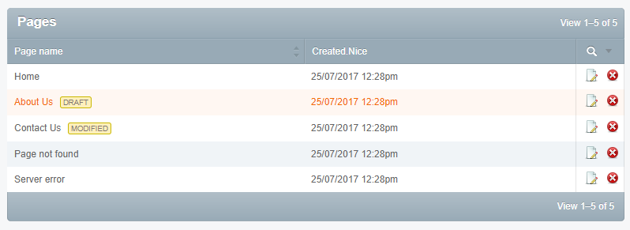

SilverStripe VersionedGridRows
===================================

This module extends GridField to add some styles and labels for showing the published state of versioned objects.




Maintainer Contacts
-------------------
Nathan Cox (<me@nathan.net.nz>)

Requirements
------------
* SilverStripe 3.1+

Documentation
-------------
[GitHub](https://github.com/nathancox/silverstripe-versionedgridrows/wiki)

Installation Instructions
-------------------------

With composer:

```shell
composer require nathancox/versionedgridrows
```


Usage Overview
--------------

Configuration via `config.yml`:

```yaml
VersionedGridRows:
  mode: 'component'			# can be "component", "config" or "always"
  show_published: false		# set to true to show a flag on published items as well
```

Options for the mode setting:

**mode: 'component'**

Only add row styles to GridFields with the VersionGridRows component added to them.  This is done like any other component:

```php
$gridFieldConfig->addComponent(new VersionedGridRows('Title'));
```
The constructor argument ("Title") specifies the name of the column the "draft" or "modified" flags will be appended to.  Leave blank to not automatically append the flags.

**mode: 'always'**

Styles will be added to all GridFields that managed versioned objects.  If you want to add flags  you need to do it manually with something like this:

```php
$summary_fields = array(
	'VersionedTitle' => 'Title'
);

...

public function VersionedTitle()
{
	return VersionedGridRows::get_column_content($this, $this->Title);
}

```

**mode: 'config'**

Specify a list of classes that styles will be added to.

```yaml
VersionedGridRow:
  mode: 'config'
  classes:
  	- Page
  	- StaffMember
  	- HomepageSlide
```

You will have to add version status flags manually as shown above.


Known Issues
------------
[Issue Tracker](https://github.com/nathancox/silverstripe-versionedgridrows/issues)
